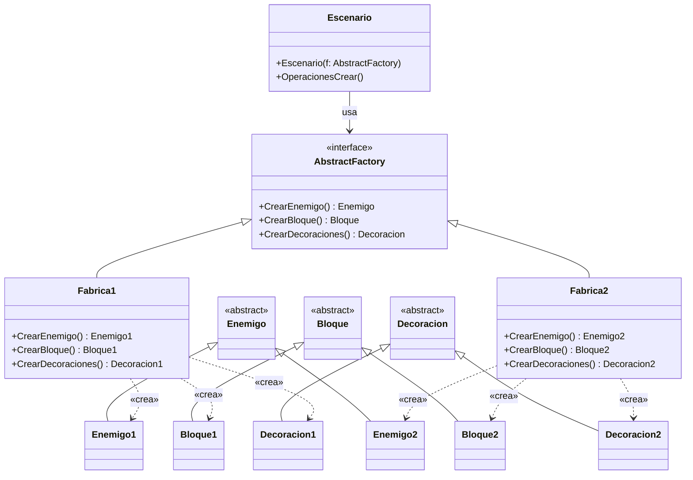
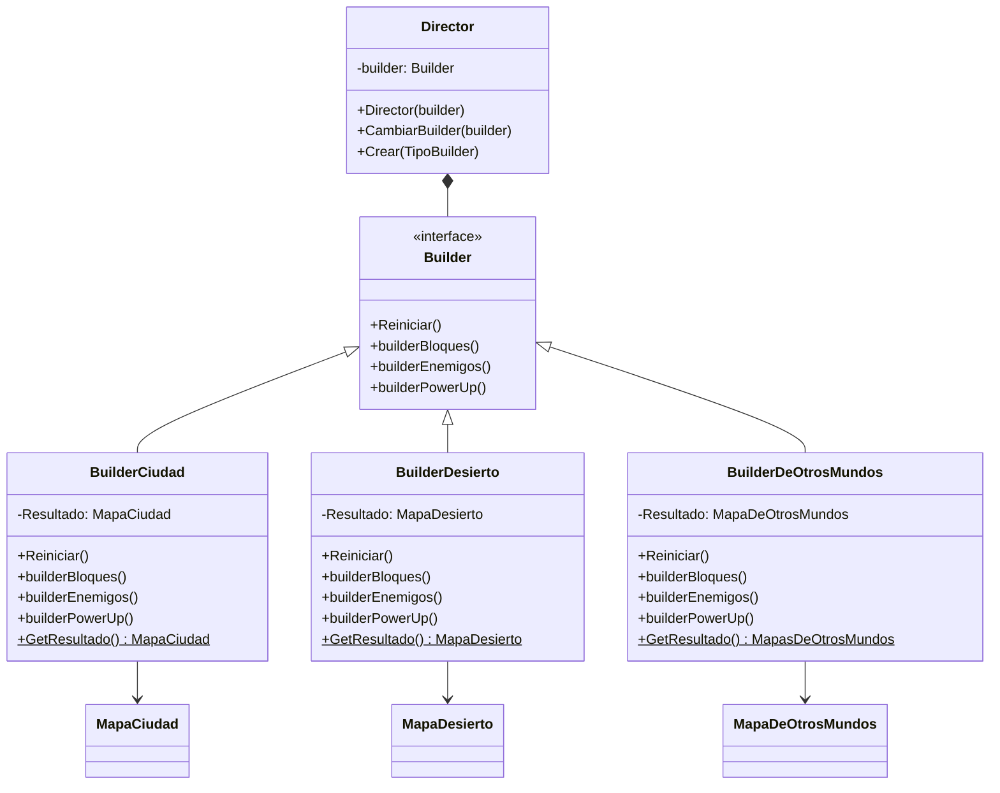
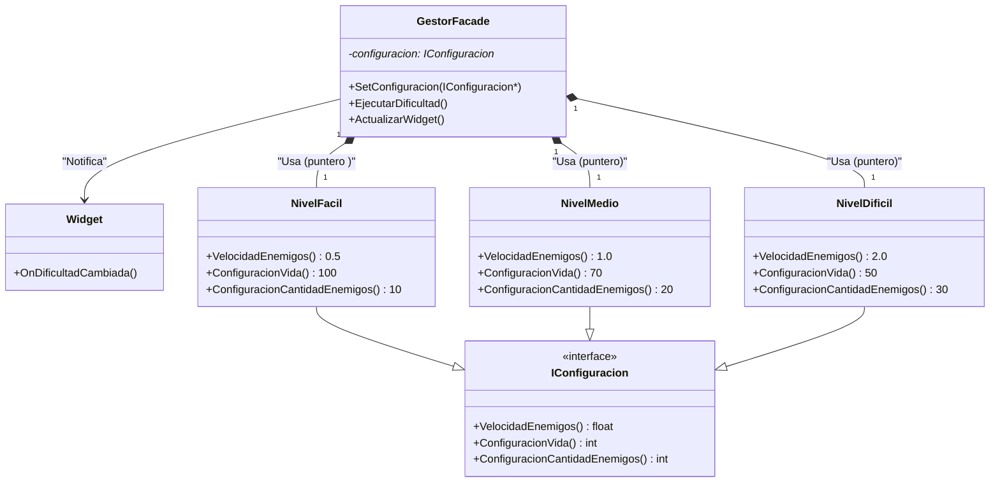
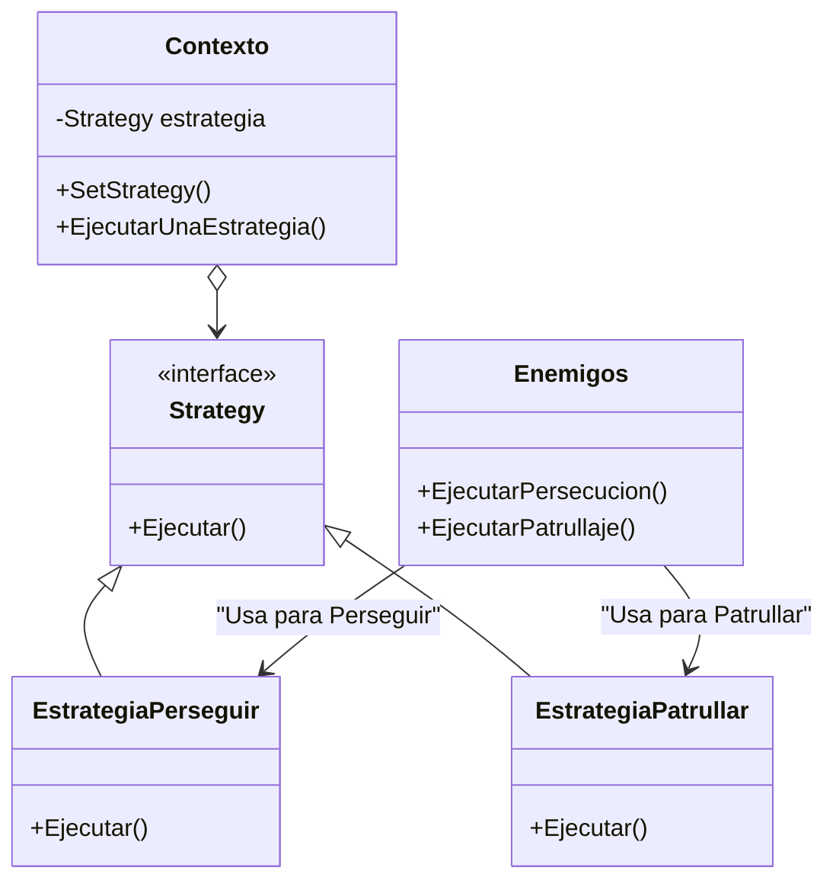
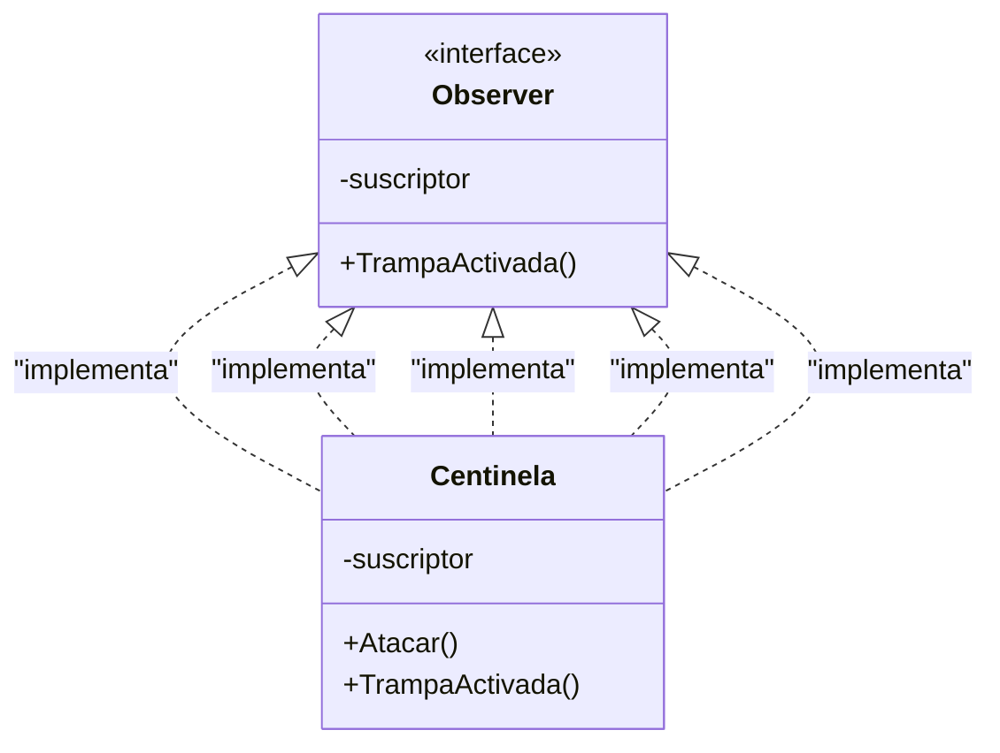

# 🎮 *BomberMan FanGame* 🎮

El clásico renace con nuevas reglas... y más explosiones.

---

## 🌌 *Sinopsis del Juego*

Sumérgete en un universo alternativo donde las bombas no solo destruyen, también construyen el camino hacia la victoria.
*BomberMan FanGame* es un videojuego creado con *Unreal Engine 5.5.3* que combina acción, estrategia y exploración.
Controla a un personaje icónico mientras atraviesas escenarios misteriosos, enfrentas enemigos impredecibles y colocas bombas como única arma y aliada.

---

## 🔍 *Resumen del Proyecto*

🎮 *Tipo de juego:* Aventura - Acción táctica
🏛️ *Universidad:* Universidad San Francisco Xavier de Chuquisaca 
🏫 *Facultad:* Tecnología
📚 *Materia:* Programación Avanzada (SIS-457)
👨‍🏫 *Docente guía:* Ing. Carlos Walter Pacheco Lora
📆 *Semestre:* 1/2025

---

## 👨‍💻 *Equipo de Desarrollo*

* 💣 *Alex Josué Calatayud Mamani*
* 💣 *Luis Fernando Quispe Sullca*

---

## 🧩 *Componentes y Módulos Clave*

| Módulo                      | Descripción                                                      |
| --------------------------- | ---------------------------------------------------------------- |
| 🧨 *Sistema de Bombas*    | Explosiones dinámicas con lógica de daño y física realista.      |
| 🤖 *IA de Enemigos*       | Patrullaje, detección, persecución.                     |
| 🧪 *Power-Ups*            | Mejora de habilidades: velocidad, mayor rango de daño con explosiones.     |
| 🏴‍☠️ *Enemigo Final*     | Jefes con inteligencia adaptativa y patrones únicos.             |
| ⚙️ *Trampas & Centinelas* | Elementos interactivos como sensores y proyectiles inteligentes. |
---

## 🧠 *Patrones de Diseño Utilizados*

📦 *Abstract Factory*

> Generación flexible de enemigos según familia y tipo.

🏗️ *Builder*

> Construcción progresiva de niveles y obstáculos.

---
🎭 *Facade*

> Control centralizado del sistema de jugador y entorno para el nivel de dificultad.

---
⚔️ *Strategy*

> Algoritmos de combate variables según distancia y contexto.

----
🧿 *Observer*

> Activación de eventos de trampas al interactuar con el entorno.

---

## 🌄 *Vista Previa del Proyecto*

Incluye:

* 📑 Documentación técnica detallada
* 📊 Diagramas UML
* 🧠 Lógica y diseño de IA enemiga
* 🔄 Sistema de colisiones y físicas
* 📸 Capturas y escenas jugables
* 🧾 Código fuente completo en GitHub

---

## 🌐 *Próximamente Disponible*

📥 *Enlace al ejecutable*
(En fase de pruebas finales y empaquetado.)

---

💥 ¡Piensa rápido, coloca bien tus bombas y domina el laberinto! 💥

Explota con nosotros el universo de *BomberMan FanGame* y revive la esencia de un clásico desde una nueva dimensión.
