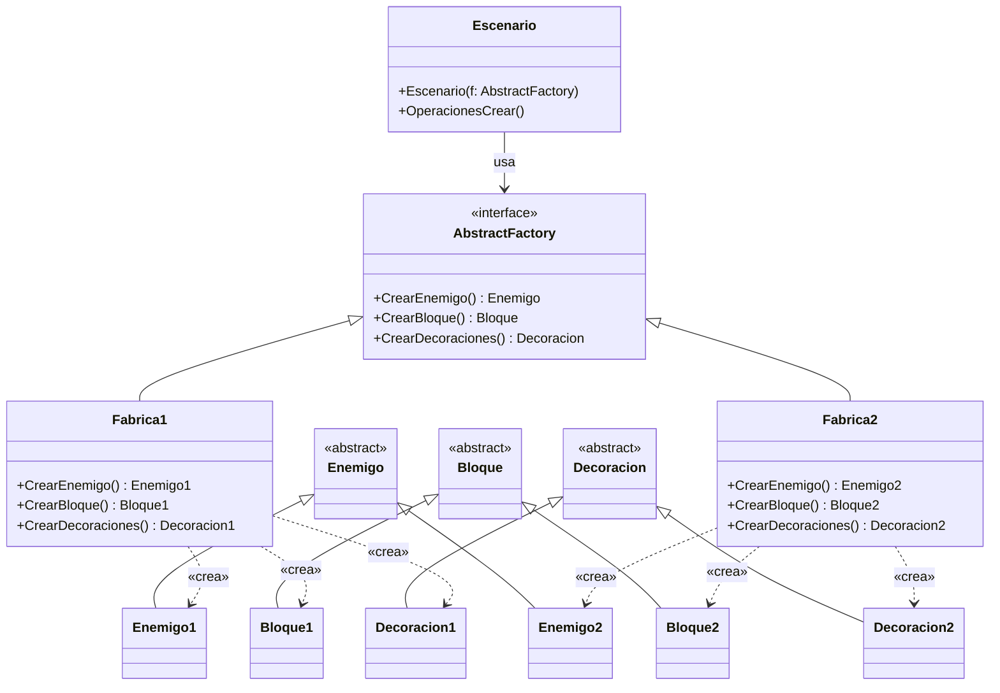
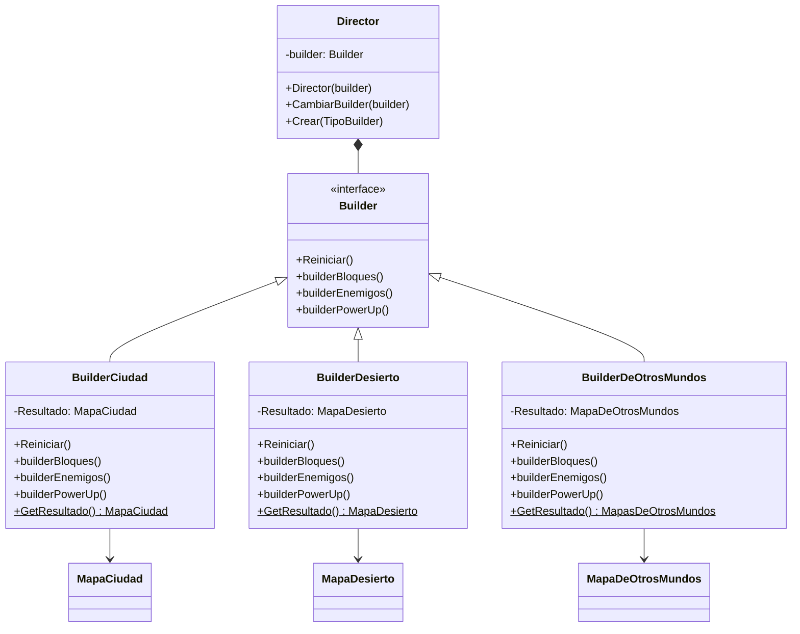
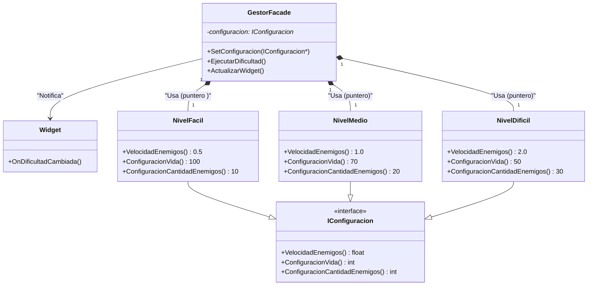
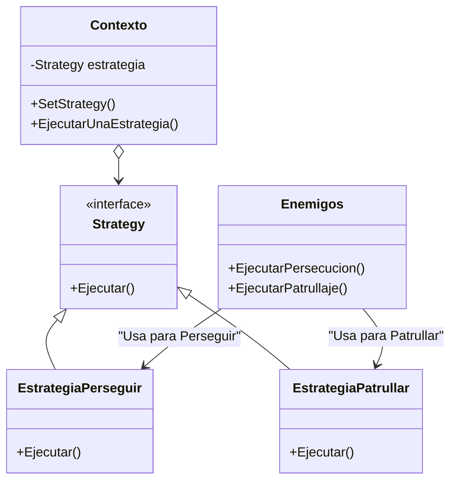
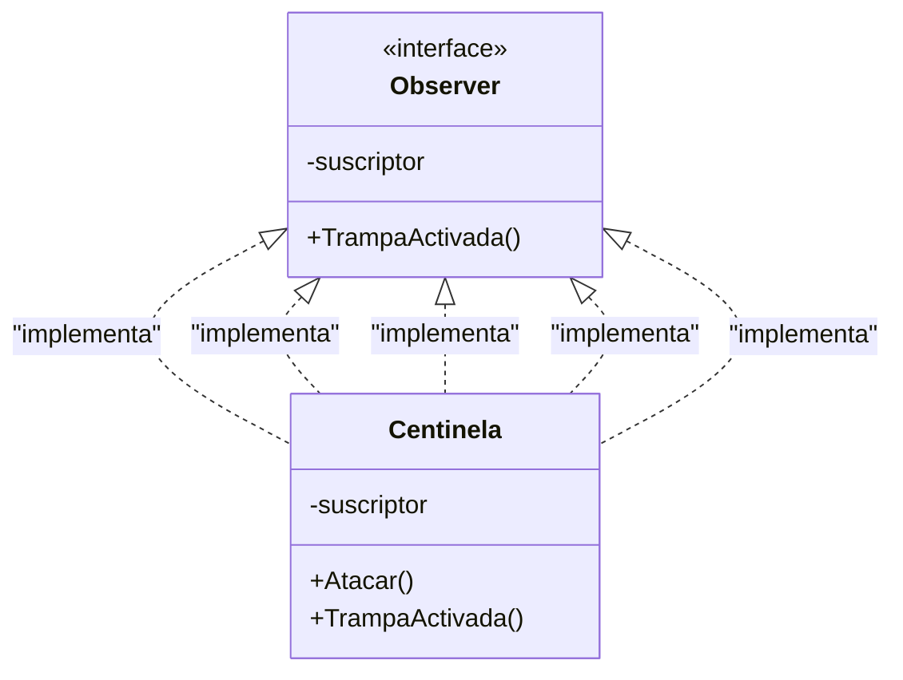

# 🎮 *BomberMan FanGame* 🎮

El clásico juego renace con nuevas reglas... y más explosiones.

<table style="width:100%;">
  <tr>
    <td style="width:30%; text-align:center; vertical-align:top;">
      
    </td>
    <td style="width:70%; vertical-align:top; padding-left:30px;">
      <h2>🏆 Premiación</h2>
      

        Nos enorgullece compartir que este proyecto fue galardonado con el <strong>Primer lugar</strong> en la competencia.
      

      <h2>📂 Categoría</h2>
      

        Este reconocimiento se obtuvo dentro de la categoría <strong>Exposición Libre</strong>, destacando por creatividad, presentación y desarrollo técnico.
      

    </td>
  </tr>
</table>

## 🏆 Premiación

- **Primer lugar**

## 👨‍💻 Categoría

- **Exposición Libre**

## 🌌 *Sinopsis del Juego*

Sumérgete en un universo alternativo donde las bombas no solo destruyen, también construyen el camino hacia la victoria.
*BomberMan FanGame* es un videojuego creado con *Unreal Engine 5.5.3* que combina acción, estrategia y exploración.
Controla a un personaje icónico mientras atraviesas escenarios misteriosos, enfrentas enemigos impredecibles y colocas bombas como única arma y aliada.

---

## 🔍 *Resumen del Proyecto*

🎮 *Tipo de juego:* Aventura - Acción táctica
🏛️ *Universidad:* Universidad San Francisco Xavier de Chuquisaca 
🏫 *Facultad:* Tecnología
📚 *Materia:* Programación Avanzada (SIS-457)
👨‍🏫 *Docente guía:* Ing. Carlos Walter Pacheco Lora
📆 *Semestre:* 1/2025

---

## 👨‍💻 *Equipo de Desarrollo*
  
<h1 align="center"><b>* 💣 Alex Josué Calatayud Mamani        Ing. SIS*  </b></h1>

📞*Contactos*

  
<h1 align="center"><b>* 💣 Luis Fernando Quispe Sullca         Ing. CICO* </b></h1>

📞*Contactos*
<!-- Contactos:START -->

  

## 📝 Licencia

Este proyecto está bajo la licencia MIT.  
Consulta el archivo [LICENSE](./LICENSE) para más detalles.

## 🧩 *Componentes y Módulos Clave*

| Módulo                      | Descripción                                                      |
| --------------------------- | ---------------------------------------------------------------- |
| 🧨 *Sistema de Bombas*    | Explosiones dinámicas con lógica de daño y física realista.      |
| 🤖 *IA de Enemigos*       | Patrullaje, detección, persecución.                     |
| 🧪 *Power-Ups*            | Mejora de habilidades: velocidad, mayor rango de daño con explosiones.     |
| 🏴‍☠️ *Enemigo Final*     | Jefes con inteligencia adaptativa y patrones únicos.             |
| ⚙️ *Trampas & Centinelas* | Elementos interactivos como sensores y proyectiles inteligentes. |
---

## 🧠 *Patrones de Diseño Utilizados*

📦 *Abstract Factory*

> Generación flexible de enemigos según familia y tipo.

🏗️ *Builder*

> Construcción progresiva de niveles y obstáculos.

---
🎭 *Facade*

> Control centralizado del sistema de jugador y entorno para el nivel de dificultad.

---
⚔️ *Strategy*

> Algoritmos de combate variables según distancia y contexto.

----
🧿 *Observer*

> Activación de eventos de trampas al interactuar con el entorno.

---

## 🌄 *Vista Previa del Proyecto*

Incluye:

* 📑 Documentación técnica detallada
* 📊 Diagramas UML
* 🧠 Lógica y diseño de IA enemiga
* 🔄 Sistema de colisiones y físicas
* 📸 Capturas y escenas jugables
* 🧾 Código fuente completo en GitHub
  

  <!-- Fila 1 -->
  
  

  <!-- Fila 2 -->
  
  
  

  

---

## 🌐 *Enlaces acerca del proyecto*

📥 *Enlace al ejecutable ZIP*

[sha256:50588c117b9d13cfb1ed72e7969c25e5f48fa30bd8d4d3f7b7483dd25e52af3e](https://github.com/Alex-JC-dot/BombermanUSFX/releases/download/Tag-1/Windows.zip)

---

## ⚙️ *Equipo Utilizado*

---

💥 ¡Piensa rápido, coloca bien tus bombas y domina el laberinto! 💥

Explota con nosotros el universo de *BomberMan FanGame* y revive la esencia de un clásico desde una nueva dimensión.
